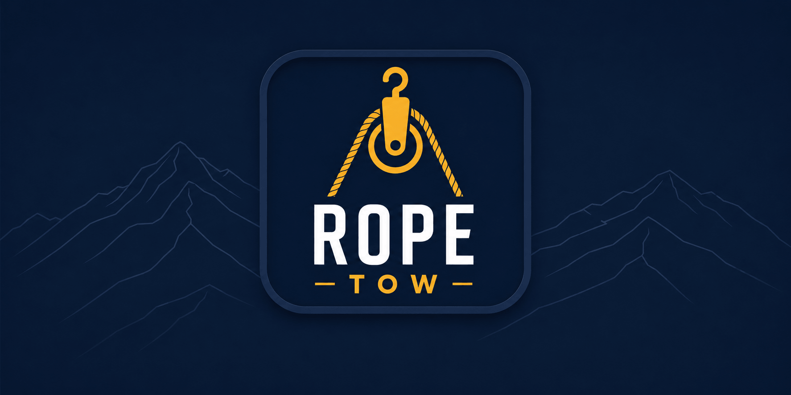

# **Rope Tow**

> Rope Tow is your new favorite WordPress starter theme. Fast, modern, and flexible, Rope Tow is the perfect foundation for your next WordPress project.



## **Prerequisites**

Before you start with Rope Tow, ensure you have the following setup:

- **macOS Users:** We recommend [laravel/valet](https://laravel.com/docs/master/valet) for an effortless dev environment configuration.
- A local web server: Either Apache or Nginx.
- [Node.js](https://nodejs.org/)
- [wp-cli](https://wp-cli.org/)

## **Theme Setup**

All build tooling lives inside the theme directory:

```bash
cd wp-content/themes/rope-tow
npm install
```

### **Rope Tow CLI (Local)**

After `npm install`, run the block scaffolding CLI locally (no global link required):

```bash
npm exec -- rope-tow new block your-block-name
```

Example:

```bash
npm exec -- rope-tow new block feature-cards
```

This command will:

- Create a new block folder in `wp-content/themes/rope-tow/blocks/`
- Generate a block scaffold (block.json, jsx, php, scss, editor.scss)
- Add the block import to `assets/admin/js/blocks/editor.js`
- Add the block stylesheet include to `assets/scss/blocks/_all.scss`

If you want a cleaner command than `npm exec -- ...` without global linking, add this shell function to your `~/.zshrc`:

```bash
rope-tow() {
	local repo_root
	repo_root="$(git rev-parse --show-toplevel 2>/dev/null)" || {
		echo "Not inside a git repository."
		return 1
	}

	local theme_dir="$repo_root/wp-content/themes/rope-tow"
	if [[ ! -d "$theme_dir" ]]; then
		echo "Could not find rope-tow theme directory at: $theme_dir"
		return 1
	fi

	(
		cd "$theme_dir" || exit 1
		npm exec -- rope-tow "$@"
	)
}
```

Then reload your shell and run:

```bash
rope-tow new block your-block-name
```

## **Development**

Start the Vite dev server with HMR (Hot Module Replacement):

```bash
npm run dev
```

Clone the `wp-config-sample.php` into a new `wp-config.php` file, updating the database info to match your local setup.

## **Build**

Compile and hash assets for production:

```bash
npm run build
```

Output goes to `wp-content/themes/rope-tow/dist/`. Ensure `VITE_DEV_SERVER` is **not** defined in `wp-config.php` so WordPress reads from the manifest.

## **Adding Blocks**

Use the CLI instead of manual steps:

```bash
npm exec -- rope-tow new block your-block-name
```


